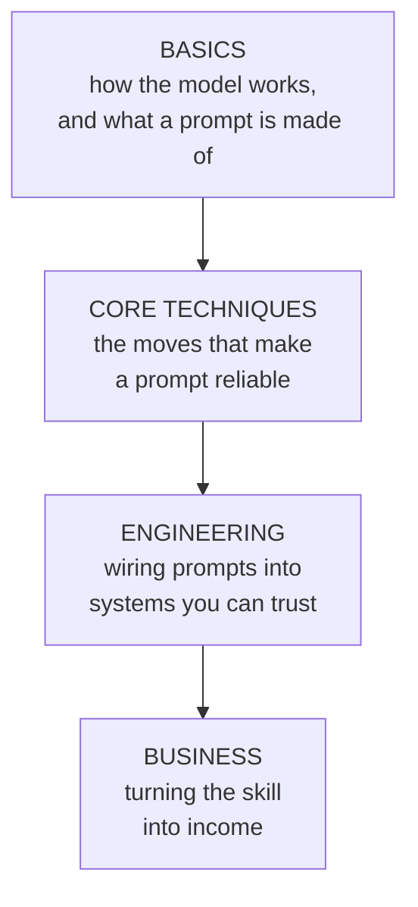
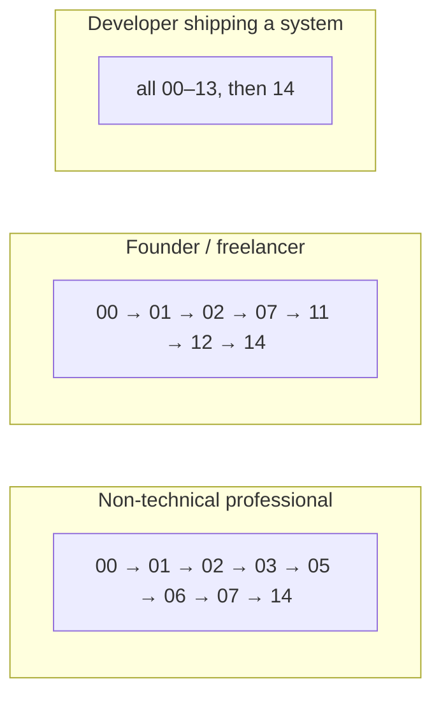

# Curriculum — Advanced Prompt Engineering

Fifteen lessons in four stages. Each stage assumes the one before it. Non-coders
can complete Basics, Core Techniques, and the Business lesson without writing a
line of code; the Engineering stage adds optional short Python for those who want
to ship systems.

---

## The stages

---

## Stage 0 — Basics (no code)

| # | Lesson | Goal |
|---|---|---|
| 00 | What a Language Model Actually Is | Replace magic with a mental model: it predicts the next token; it does not look things up or "think" between requests. |
| 01 | Anatomy of a Prompt | The six components — role, task, context, examples, format, constraints — and when each one earns its place. |
| 02 | Context & Grounding | The model knows only what is in the prompt. How to give it the facts, and why "it made that up" is usually a missing-context bug. |

## Stage 1 — Core Techniques

| # | Lesson | Goal |
|---|---|---|
| 03 | Examples (Few-Shot) | Show, don't tell. How 2–3 examples fix tone, format, and edge cases that instructions can't. |
| 04 | Reasoning (Chain of Thought) | When to let the model work in steps, when to hide the steps, and when reasoning hurts. |
| 05 | Roles & Personas | How a role changes vocabulary, judgement, and defaults — and its limits. |
| 06 | Structured Output | Getting JSON, tables, and fixed formats a machine (or a spreadsheet) can consume. |
| 07 | Constraints & Guardrails | Negative instructions, refusal behaviour, and the "if you're unsure" clause that prevents confident nonsense. |

## Stage 2 — Engineering (optional code)

| # | Lesson | Goal |
|---|---|---|
| 08 | Chaining & Pipelines | Splitting one unreliable mega-prompt into a sequence of small, testable ones. |
| 09 | Retrieval (RAG) | Feeding the model your own documents so its answers are grounded in fact, not memory. |
| 10 | Agents & Tools | Letting the model call tools, read results, and take actions in a loop. |
| 11 | Evaluation | Building the eval set — the real asset. Measuring a prompt so you can improve it and prove it works. |
| 12 | Prompt Security | Prompt injection, jailbreaks, system-prompt leakage, and the instruction/data boundary. |
| 13 | Cost, Tokens & Latency | Why every word is money and time, and how to cut both without losing quality. |

## Stage 3 — Business

| # | Lesson | Goal |
|---|---|---|
| 14 | Prompt Engineering as a Business | Five business shapes, how to price, where the moat is, and a 30-day plan to a first paid workflow. |

---

## Suggested tracks

Not everyone needs every lesson at once.

- **Non-technical professional:** everything except the heavy engineering. You
  will be able to write prompts that work and know when one is failing.
- **Founder / freelancer:** the basics, plus evaluation and security (the two
  things that make a workflow sellable), plus the business lesson.
- **Developer:** the whole thing, in order.

---

## What "done" looks like

By the end you should be able to:

1. Take a vague request and turn it into a prompt that works on the first try
   more often than not.
2. Explain *why* a failing prompt is failing (missing context? wrong format? no
   examples? no guardrail?) instead of randomly rewording it.
3. Wire several prompts into a pipeline and measure whether the whole thing works.
4. Spot a prompt-injection risk before it ships.
5. Describe a real, sellable prompt-engineering service and price it.
