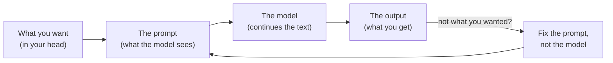
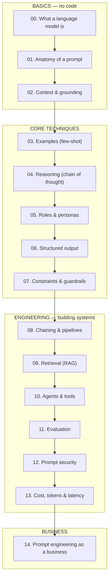
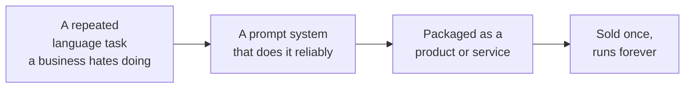

# Advanced Prompt Engineering — Tayel AI Labs

**You do not need to be a coder to take this course.**

A prompt is the instruction you give an AI model. Prompt engineering is the
craft of writing that instruction so the model does the right thing *reliably* —
not once, by luck, but the hundredth time, for a customer you never met, at 2am,
when it matters. That reliability is the whole job, and it is a skill you can
learn and sell.

This course teaches it from zero. It starts with a mental model of what these
systems actually are, walks through every technique that makes a prompt work,
shows you a **weak version and a good version of the same prompt** at every step
so you can see the difference, and ends by showing how the same skill becomes a
product, a service, and a company.

---

## Who this is for

| You are… | What you get here |
|---|---|
| A **non-technical professional** (marketing, ops, support, teaching, law, medicine) | A way to make AI do your repetitive work correctly, in your own words. No code required for lessons 00–07 and 14. |
| A **founder or freelancer** | A concrete map of what a prompt-engineering business sells, how it prices, and where the moat is (lesson 14). |
| A **developer** | The engineering discipline — pipelines, evaluation, security, cost — that turns a clever prompt into a system you can ship (lessons 08–13). |

If you can write clear instructions to a smart new hire, you can do this. The
whole course is that idea, made rigorous.

---

## The core idea, in one picture

A model does not "understand" your request the way a person does. It continues
text in the most probable way, given everything you put in front of it. So the
prompt is not a wish — it is the *entire world* the model gets to see. Change
the world, change the output.

Every technique in this course is a different way to make column B — the world
the model sees — match column A, the thing you actually wanted.

---

## Weak vs Good — the one habit that matters

Beginners write what they *want*. Prompt engineers write what the model *needs*
to produce it. Same request, two prompts:

> **Weak:** "Write a product description for my coffee."
>
> **Good:** "You are writing for an Egyptian specialty-coffee shop's online menu.
> Write a 40-word description of our Ethiopian Yirgacheffe, single-origin, light
> roast, with notes of jasmine and lemon. Tone: warm, confident, no clichés like
> 'exquisite' or 'journey'. Arabic first, then an English line beneath it."

The weak prompt gets you a generic paragraph you will rewrite anyway. The good
one gets you something you can paste. The difference is not talent — it is
knowing the six things a model needs, which is [Lesson 01](lessons/01-anatomy-of-a-prompt.md).

[`examples/weak-vs-good.md`](examples/weak-vs-good.md) collects dozens of these
pairs, one per technique, so you can study the move directly.

---

## The path

Follow it top to bottom. Basics first, then the techniques that build on them,
then the engineering, then the business. Full detail in
[`CURRICULUM.md`](CURRICULUM.md).

## Lessons

| # | Lesson | The one thing you take away |
|---|---|---|
| 00 | [What a Language Model Actually Is](lessons/00-what-is-a-language-model.md) | It predicts text; it does not look things up. |
| 01 | [Anatomy of a Prompt](lessons/01-anatomy-of-a-prompt.md) | Role, task, context, examples, format, constraints. |
| 02 | [Context & Grounding](lessons/02-context-and-grounding.md) | The model only knows what you put in the prompt. |
| 03 | [Examples — Few-Shot Prompting](lessons/03-examples-few-shot.md) | Showing beats telling; 2–3 examples fix most drift. |
| 04 | [Reasoning — Chain of Thought](lessons/04-reasoning-chain-of-thought.md) | Let it think in steps before it answers. |
| 05 | [Roles & Personas](lessons/05-roles-and-personas.md) | A role sets vocabulary, judgement, and defaults. |
| 06 | [Structured Output](lessons/06-structured-output.md) | Ask for JSON/tables when a machine reads the answer. |
| 07 | [Constraints & Guardrails](lessons/07-constraints-and-guardrails.md) | Tell it what *not* to do, and what to do when unsure. |
| 08 | [Chaining & Pipelines](lessons/08-prompt-chaining-pipelines.md) | Break one hard prompt into several reliable ones. |
| 09 | [Retrieval — RAG](lessons/09-retrieval-rag.md) | Give it your documents so it stops guessing. |
| 10 | [Agents & Tools](lessons/10-agents-and-tools.md) | Let the model call tools and act, not just talk. |
| 11 | [Evaluation](lessons/11-evaluation.md) | You cannot improve a prompt you do not measure. |
| 12 | [Prompt Security](lessons/12-prompt-security.md) | Injection, jailbreaks, and leaking your system prompt. |
| 13 | [Cost, Tokens & Latency](lessons/13-cost-tokens-latency.md) | Every word is money and milliseconds. |
| 14 | [Prompt Engineering as a Business](lessons/14-prompt-engineering-as-a-business.md) | How this skill becomes a product and a company. |

## Also in this repo

- [`examples/weak-vs-good.md`](examples/weak-vs-good.md) — paired prompts, weak and
  good, for every technique. The fastest way to learn the moves.
- [`system-maps/pipelines.md`](system-maps/pipelines.md) — diagrams of how real
  prompt systems are wired: a support bot, a RAG pipeline, an agent loop, an
  evaluation harness, a content factory.
- [`templates/prompt-template.md`](templates/prompt-template.md) — a fill-in-the-
  blanks scaffold you can copy for any new prompt.

---

## How prompt engineering becomes a company

This is the part people miss, so it gets its own lesson ([14](lessons/14-prompt-engineering-as-a-business.md))
and its own summary here.

Every business runs on repeated language tasks: answering the same customer
questions, writing the same kinds of descriptions, reading the same kinds of
documents, sorting the same kinds of requests. A prompt engineer turns one of
those repeated tasks into a reliable AI workflow — and *reliable* is the word
that gets paid for.

Concrete shapes this takes:

| Shape | What you sell | Example |
|---|---|---|
| **Freelance / done-for-you** | Build a client one reliable workflow | A clinic's WhatsApp bot that books appointments and never invents a doctor's schedule |
| **Productised service** | The same workflow, sold to many clients in one vertical | "Menu-to-website" for restaurants; "contract summariser" for small law firms |
| **Micro-SaaS** | A hosted tool wrapping your prompt system | A tool that turns support tickets into drafted replies for e-commerce teams |
| **Internal role** | Prompt engineering inside a company | Cutting a support team's handle time in half |
| **Teaching** | The skill itself | This course |

The moat is not the prompt — prompts are copyable. The moat is the **evaluation
set, the domain knowledge, and the reliability** you built around it: knowing it
works, proving it works, and keeping it working when the model changes. That is
exactly what lessons 08–13 teach, and it is why this course spends as much time
on measurement and security as on wording.

---

## A note on models and tools

The techniques here are **model-agnostic** — they work with any modern chat
model. Examples use plain English prompts you can paste into any assistant; a
few developer lessons show short Python, but every one of those is optional and
labelled. Where a technique behaves differently on a small model than a large
one, the lesson says so.

You do not need an API key or a paid account to learn from this course. You need
a chat model you can talk to and the willingness to rewrite a prompt five times.

---

## License

[MIT](LICENSE) — Tayel AI Labs Courses. Use it, teach from it, build on it.
