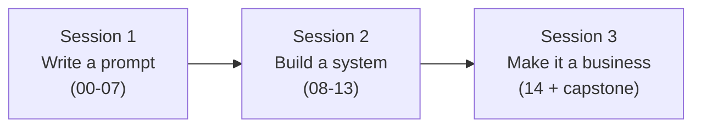

# Session Plan — Course in 3 Sessions

The 15 lessons, split into three teaching sessions. Each session has a **goal**,
the **lessons to cover**, what to **do live**, and a **task** the attendees take
away and complete before the next session.

Keep every session the same shape: teach → show a weak-vs-good pair → they do the
task. The task is where the learning actually happens.

---

## Session 1 — Write a prompt that works
*Foundations + core techniques · no code*

**Goal:** by the end, attendees can take a vague request and turn it into a prompt
that works most of the time, and can say *why* a bad prompt is failing.

**Lessons:** 00 → 01 → 02 → 03 → 04 → 05 → 06 → 07
(what a model is, anatomy of a prompt, context, few-shot, reasoning, roles,
structured output, guardrails)

**Do live:** open [`examples/weak-vs-good.md`](examples/weak-vs-good.md) and walk
through pairs 1–7 together. For each, let them guess what's missing before you
show the good version.

**Task (bring to Session 2):**
> Pick one real prompt you use. Rewrite it using the six components
> ([`templates/prompt-template.md`](templates/prompt-template.md)), add a
> guardrail ("if unsure, don't guess"), and ground it in real facts. Bring the
> before and after.

---

## Session 2 — Turn prompts into a system
*Engineering · optional code*

**Goal:** by the end, attendees understand how single prompts combine into a
reliable system they can trust and measure.

**Lessons:** 08 → 09 → 10 → 11 → 12 → 13
(chaining/pipelines, RAG, agents & tools, evaluation, security, cost)

**Do live:** open [`system-maps/pipelines.md`](system-maps/pipelines.md) on a big
screen. Walk through map 1 (support bot), map 3 (RAG), and map 6 (eval harness).
Then do weak-vs-good pairs 8–13 together.

**Task (bring to Session 3):**
> Take your Session 1 prompt and (a) collect 10 real, varied inputs as a tiny
> **eval set**, (b) note what a correct output must satisfy for each, and (c) try
> one prompt-injection attack on it and add a defence. If your task has steps,
> sketch it as a pipeline.

---

## Session 3 — Make it a business
*Business + capstone*

**Goal:** by the end, each attendee has a real, reliable workflow and a one-
sentence offer they could sell.

**Lessons:** 14 (prompt engineering as a business) + full recap

**Do live:** walk through the five business shapes and the moat diagram in
[Lesson 14](lessons/14-prompt-engineering-as-a-business.md). Do weak-vs-good pair
14 (the pitch). Then launch the **capstone** below.

**Capstone (the main event):** build a complete clothing store web app —
including an AI shopping assistant — entirely by prompting Claude, step by step.
Full guide with the exact prompts and the principle behind each one:
[`capstone-clothing-store.md`](capstone-clothing-store.md). It ties the *whole
course* together: every build step is a prompt using the six components,
structured output, grounding, chaining, guardrails, evaluation, and security.
Do as much as time allows live; the rest is the take-home.

**Task (capstone):**
> Finish the clothing-store capstone, then write your one-sentence offer: *"For
> [niche], I build [workflow] that [outcome], proven by [your eval], priced at
> [setup + monthly]."* Fill every blank. The blank you can't fill is the lesson
> to revisit.

---

## At a glance

| Session | Lessons | Takeaway task |
|---|---|---|
| 1 | 00–07 | Rewrite one real prompt with all six components + a guardrail |
| 2 | 08–13 | Build a 10-input eval set + survive one injection attack |
| 3 | 14 | Build the clothing-store capstone + write a sellable one-sentence offer |

**Pacing note:** Session 1 is the heaviest (8 lessons) but all light and no-code —
it moves fast. Session 2 is the deepest — don't rush the eval and security parts,
they're what make a workflow sellable. Session 3 is short on teaching, long on
attendees presenting their own work.
