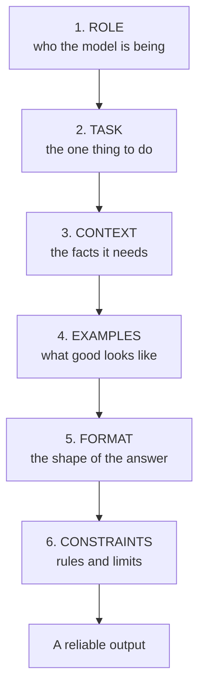
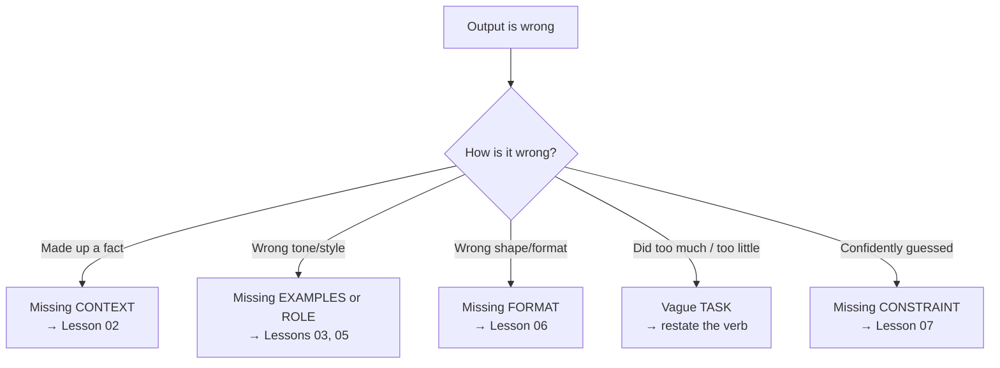

# Lesson 01 — Anatomy of a Prompt

**Goal:** learn the six components of a working prompt, so that when one fails
you know exactly which part to fix instead of randomly rewording it.

## What you will learn

- The six components every strong prompt is built from
- Which ones a given task actually needs (you rarely need all six)
- How to diagnose a failing prompt by naming the missing part

---

## The six components

Almost every good prompt is some combination of these. Think of them as
ingredients, not a rigid template — you add the ones the task needs.

### 1. Role — *who the model is being*

Sets vocabulary, judgement, and defaults in one line.
`You are a senior pediatric nurse triaging messages from worried parents.`
The model now leans on the right register and priorities. (Full lesson: 05.)

### 2. Task — *the one thing to do*

The single most important line. State the action as a verb, and make it one job,
not five. "Summarise this contract in five bullet points" is a task. "Help me
with this contract" is not — help how?

### 3. Context — *the facts it needs*

Everything the model cannot know unless you tell it: the document, the customer's
history, your brand rules, today's date, the constraints of your business. This
is where most prompts fail. (Full lesson: 02.)

### 4. Examples — *what good looks like*

One to three worked examples of input → desired output. This fixes tone and
format faster than any amount of description. (Full lesson: 03.)

### 5. Format — *the shape of the answer*

"Reply as a table with columns X, Y, Z." "Return JSON." "Three sentences, no
bullet points." If a human or a machine downstream expects a shape, name the
shape. (Full lesson: 06.)

### 6. Constraints — *rules and limits*

Length, tone, what to avoid, and — critically — what to do when the model is
unsure or the input is bad. "If the document doesn't mention a price, write
'not stated', don't guess." (Full lesson: 07.)

---

## You rarely need all six

A quick internal request needs a **task** and maybe a **format**. A customer-
facing production prompt needs all six. Adding components you don't need makes
the prompt longer, slower, and more expensive for no gain. The skill is knowing
which ones the job requires.

| Situation | Components that earn their place |
|---|---|
| Quick one-off ("rephrase this") | Task |
| Repeatable internal task | Task + Format + one Constraint |
| Customer-facing, must be on-brand | Role + Task + Context + Format + Constraints |
| Machine reads the output | Task + Context + Format (strict) + Constraints |
| High-stakes / must not invent facts | All six, Constraints doing heavy lifting |

---

## Weak vs Good

> **Weak:** "Summarise this email."
>
> **Good:**
> `You are my assistant triaging my inbox.` *(role)*
> `Summarise the email below in one sentence, then list any action it asks me to
> take.` *(task + format)*
> `The email:` *(context)* `"""<pasted email>"""`
> `If it asks for nothing, write "No action needed." Do not invent deadlines that
> aren't in the text.` *(constraints)*

The weak version gets you a summary you still have to read carefully to know if
you must *do* anything. The good version gets you a decision. Same model, same
email — the difference is four named components.

More paired examples: [`../examples/weak-vs-good.md`](../examples/weak-vs-good.md).

---

## Diagnosing a failing prompt

This is the payoff of naming the parts. When output is wrong, the failure almost
always maps to one missing component:

Stop rewording at random. Name the missing ingredient, add it, test again.

---

## Exercise

Take the weakest prompt you use regularly. Rewrite it, labelling each of the six
components (or noting the ones you deliberately skip and why). Run both. Keep the
one that wins — and notice *which component* made the difference.

---

**Next:** [Lesson 02 — Context & Grounding](02-context-and-grounding.md), the
component that fixes the most failures.
