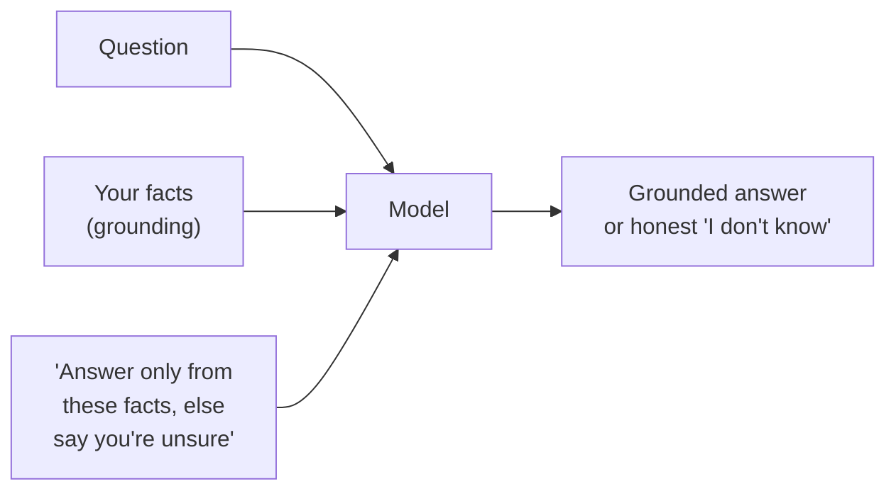

# Lesson 02 — Context & Grounding

**Goal:** understand why "it made that up" is almost always a missing-context
bug, and learn how to give the model the facts it needs so its answers are
grounded in *your* reality, not its training-average guess.

## What you will learn

- The difference between what the model *knows* and what it *needs*
- How to put facts in the prompt cleanly (delimiters, structure)
- "Grounding": telling the model to answer *only* from what you gave it
- Where context runs out, and what to do then (preview of RAG)

---

## The model knows the average, not your specifics

From Lesson 00: the model continues text using patterns from its training. So it
knows the *average* restaurant menu, the *average* refund policy, the *average*
Egyptian mobile number format. It does not know **yours**. When you ask about
your specifics without providing them, it fills the gap with the average — and
the average is wrong for you.

> "Why did it say we're open on Fridays? We're closed Fridays." — because you
> never told it your hours, and most cafes are open Fridays. It guessed the
> average.

Context is how you overwrite the average with your truth.

---

## Put the facts in the prompt — cleanly

Two rules make context work:

**1. Include everything the model can't otherwise know.** Hours, prices, names,
today's date, the document, the customer's last order, your rules. If a smart
stranger would need it to answer, it goes in.

**2. Separate facts from instructions with delimiters.** Wrap pasted content in
clear markers so the model can tell *"this is the data to work on"* from *"this
is what to do."* Triple quotes, XML-style tags, or fenced blocks all work:

```text
Answer the customer's question using ONLY the policy below.

<policy>
Refunds are accepted within 14 days with a receipt. No refunds on
sale items. Exchanges allowed within 30 days.
</policy>

Customer question: "Can I return a discounted mug I bought 3 weeks ago?"
```

The delimiters are not decoration. They are the line between *instructions* (which
the model should follow) and *data* (which it should only read). That same line
is the whole of prompt security in Lesson 12 — content inside the data block
must never be treated as a new instruction.

---

## Grounding: "answer only from what I gave you"

Including the facts is half of it. The other half is *forbidding the model from
using anything else*:

> `Answer using only the policy above. If the policy does not cover the
> question, reply: "I'm not certain — let me check with a colleague." Do not
> guess.`

This one instruction converts a confident guesser into an honest assistant. It
is the difference between a support bot that invents a refund window and one that
escalates when it doesn't know. Grounding + permission-to-not-know is the
single most valuable pattern for any business use.



---

## Weak vs Good

> **Weak:** "What's our return policy for sale items?"
> → The model invents a plausible policy. It might even sound right. It is not
> yours.
>
> **Good:** "Using only the policy in the block below, answer: what's our return
> policy for sale items? If it's not covered, say so. `<policy>…</policy>`"
> → "No refunds on sale items, per the policy." Correct, and it would have
> admitted it if the policy were silent.

---

## Where context runs out

You can only paste so much. A model has a **context window** — a maximum amount
of text it can read at once. You cannot paste a 500-page manual into every
question, and you shouldn't: it's slow, expensive, and the model attends less
well to a needle in a huge haystack.

When the facts are too big to paste every time, you fetch *only the relevant
pieces* for each question and put those in the prompt. That is **retrieval-
augmented generation (RAG)**, and it is Lesson 09. For now, the principle is
enough: context is king, and RAG is just "context, but only the part you need,
fetched automatically."

---

## Common context mistakes

| Mistake | Fix |
|---|---|
| Assuming the model "knows" your business | Paste the facts every time |
| Pasting facts with no delimiters | Wrap data in `<tags>` or `"""quotes"""` |
| Giving facts but not grounding | Add "answer only from the above" |
| No escape hatch when facts are missing | Add "if not covered, say you're unsure" |
| Dumping *everything* when only a slice is relevant | Trim to what the question needs (or use RAG) |

---

## Exercise

Take a question about your own work that an AI got wrong. Identify the fact it
was missing. Rewrite the prompt with that fact in a delimited block plus a
grounding instruction. It should now answer correctly — or honestly refuse.

---

**Next:** [Lesson 03 — Examples (Few-Shot)](03-examples-few-shot.md): when
telling the model isn't enough and you have to show it.
