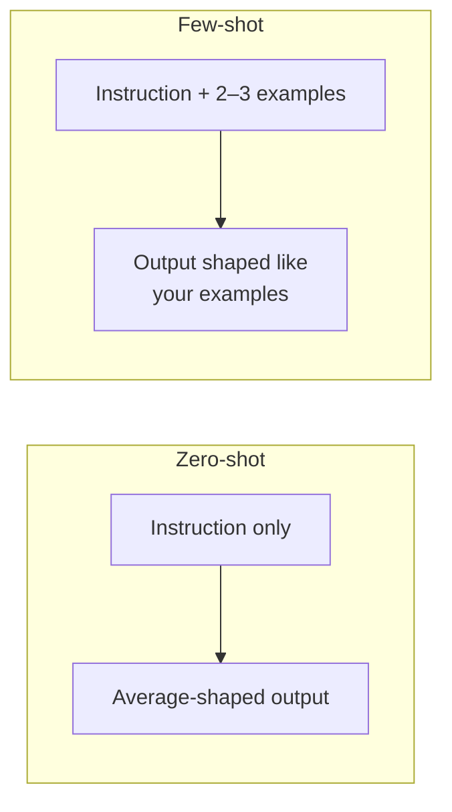

# Lesson 03 — Examples (Few-Shot Prompting)

**Goal:** learn to teach the model by showing, not just telling — the fastest fix
for tone, format, and edge-case problems that instructions alone can't solve.

## What you will learn

- Zero-shot vs few-shot, and when each wins
- How to write examples that actually steer the output
- How many examples to use, and how to pick them
- The classic mistakes that make examples backfire

---

## Showing beats telling

**Zero-shot** is a prompt with no examples — just an instruction. It's fine for
common tasks the model has seen a million times ("translate this", "fix the
grammar").

**Few-shot** adds one to a few worked examples of input → output. You are not
describing what you want; you are *demonstrating* it. For anything with a
specific tone, a house format, or a judgement call, this is the strongest tool
you have. The model is a pattern-continuer (Lesson 00) — give it the pattern and
it continues it.



---

## What a few-shot prompt looks like

Task: classify customer messages into `complaint`, `question`, or `praise`.

```text
Classify each message as: complaint, question, or praise.

Message: "The coffee was cold and the waiter ignored us."
Label: complaint

Message: "Do you have oat milk?"
Label: question

Message: "Best latte in the city, honestly."
Label: praise

Message: "I waited 20 minutes and no one took my order."
Label:
```

The model has seen the pattern three times. It completes the fourth with
`complaint`. You never defined "complaint" — the examples did.

---

## How many examples?

- **1 example** fixes format ("oh, *that* shape").
- **2–3 examples** fix format *and* teach a distinction or tone.
- **More than ~5** rarely helps for simple tasks, costs more tokens (Lesson 13),
  and can make the model over-fit to surface patterns in your examples.

Start with two. Add a third only to cover a case the first two didn't.

**Pick examples that cover the edges, not just the easy middle.** If your task
has a tricky case (sarcasm, a mixed complaint-and-praise, an Arabic-English mix),
put *that* in your examples. The model learns the boundary from where you draw it.

---

## Weak vs Good

> **Weak:** "Write our product descriptions in a fun, on-brand voice."
> → The model's idea of "fun" is generic exclamation marks and the word
> "amazing." Not your brand.
>
> **Good:** "Write product descriptions in our voice. Examples:
> `Ethiopian Yirgacheffe → 'Bright as a Cairo morning. Jasmine, lemon, and no
> apology.'`
> `House Blend → 'The one you'll order twice. Chocolate, warmth, done.'`
> Now write one for: Colombian Supremo, medium roast, caramel and orange."
> → It matches the rhythm, the length, the confidence, the no-clichés rule —
> because it saw two examples of exactly that, not a description of it.

---

## When examples backfire

| Mistake | What happens | Fix |
|---|---|---|
| Examples all look the same | Model copies a surface quirk (every output starts "The…") | Vary the examples' surface, keep the pattern |
| Only easy examples | Model fails on the hard cases you never showed | Include an edge case |
| Inconsistent examples | You labelled two similar inputs differently | Make your own examples consistent first |
| Too many examples | Slow, expensive, over-fit | Trim to the fewest that teach the boundary |
| Example answers are wrong | Model faithfully reproduces your mistake | Check your examples are correct — they *are* the spec |

That last one matters: **your examples are the specification.** A wrong example
is a wrong instruction, followed perfectly.

---

## Exercise

Take a task where the model keeps getting the *style* slightly wrong. Stop
describing the style. Write two examples of input → the exact output you'd have
been happy with. Prepend them. Watch the style lock in.

---

**Next:** [Lesson 04 — Reasoning (Chain of Thought)](04-reasoning-chain-of-thought.md):
getting the model to think before it answers.
