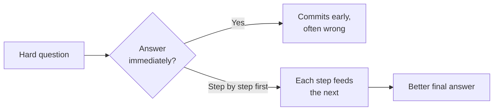

# Lesson 04 — Reasoning (Chain of Thought)

**Goal:** know when to let the model work through a problem in steps, when to
keep those steps hidden from the user, and when reasoning actually hurts.

## What you will learn

- Why "think step by step" changes answers on hard problems
- The difference between reasoning and just being verbose
- Hiding the working from the end user
- When *not* to ask for reasoning

---

## Why steps help

A model generates one token at a time (Lesson 00). If you ask a hard,
multi-step question and demand the answer immediately, it commits to the first
plausible token before it has "worked anything out" — and a wrong first step
drags the rest with it.

Give it room to lay out the steps first, and each step becomes context for the
next. The reasoning it writes becomes part of the prompt the *rest* of the answer
continues from. This is **chain of thought**, and on arithmetic, logic, multi-
constraint decisions, and anything with a "therefore," it measurably improves
accuracy.

> The magic phrase, and it really is close to this simple:
> **"Think step by step, then give your answer."**

---

## Reasoning vs verbosity

Chain of thought is not "write more." It is "work the problem in order before
concluding." A prompt that says *"be detailed"* gets you padding. A prompt that
says *"list the constraints, check the option against each, then decide"* gets
you actual reasoning. Structure the thinking; don't just ask for volume.

Newer "reasoning models" do a lot of this internally without being asked. Even
so, telling the model the *shape* of the reasoning you want ("first check
eligibility, then calculate, then explain") still helps, because it aligns the
steps with your problem instead of a generic one.

---

## Hide the working when the user shouldn't see it

Often you want the *benefit* of step-by-step reasoning but not the *wall of
steps* in the final reply. Two moves:

1. **Ask for reasoning, then a separated final answer**, and show the user only
   the final part:
   > "Reason through it in a section marked THINKING. Then give the customer-
   > facing reply in a section marked REPLY. I will only show REPLY."

2. **In a pipeline (Lesson 08)**, run a reasoning step, then a separate
   formatting step that turns the conclusion into the clean output. The user sees
   only the second step's result.

Reasoning is for accuracy; the user gets the answer, not the scratch paper.

---

## Weak vs Good

> **Weak:** "A customer bought 3 bags at 180 EGP, used a 15% coupon, and a
> 20 EGP delivery fee applies. What do they pay?"
> → The model may blurt a number, and on a bad day it's wrong.
>
> **Good:** "…What do they pay? Work it out step by step — subtotal, discount,
> delivery, total — then state the final amount on its own line."
> → Subtotal 540, −15% = 459, +20 delivery = **479 EGP**. Steps make the
> arithmetic auditable, and auditable arithmetic is correct arithmetic.

---

## When NOT to ask for reasoning

Reasoning costs tokens (money and latency, Lesson 13) and isn't free of downside:

| Don't use chain of thought when… | Because… |
|---|---|
| The task is simple lookup or rephrasing | No steps to take; you just pay for padding |
| You need a fast, cheap, high-volume response | Reasoning multiplies tokens per call |
| The output must be strict JSON only | Free-text reasoning pollutes the format — separate it or move it to another step |
| A regulated setting bans exposing "reasoning" | Keep it internal or skip it |

Rule of thumb: **reasoning for judgement and math; skip it for lookups and
transforms.**

---

## Exercise

Find a task where the model occasionally gets a *calculation or a multi-condition
decision* wrong. Add "work through it step by step before answering." Measure
whether the error rate drops. Then try hiding the steps behind a REPLY section.

---

**Next:** [Lesson 05 — Roles & Personas](05-roles-and-personas.md).
