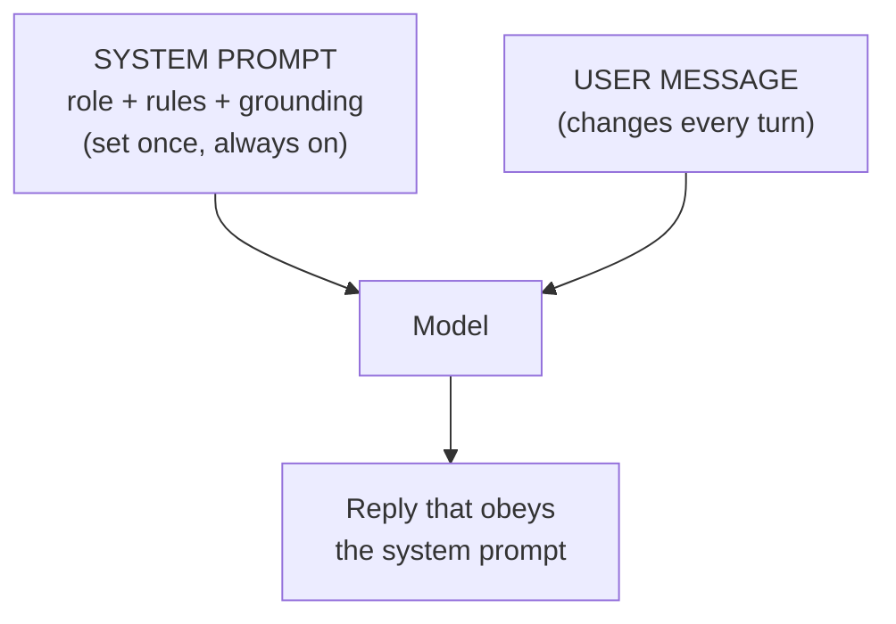

# Lesson 05 — Roles & Personas

**Goal:** use a role to set the model's vocabulary, judgement, and defaults in a
single line — and know the real limits of what a role can and cannot do.

## What you will learn

- What a role actually changes (and what it doesn't)
- Writing a role that carries weight, not decoration
- The "system prompt" — the role that governs a whole product
- Where personas mislead you

---

## What a role does

`You are a senior tax accountant reviewing a freelancer's expense list.`

That one line shifts a lot at once: the vocabulary (deductible, receipt,
category), the priorities (compliance over creativity), the defaults (it will
flag missing documentation without being told to). You are pointing the model at
a region of everything it read — the region written *by and for* tax accountants
— and asking it to continue from there.

A good role answers three implicit questions:

| Question | Example |
|---|---|
| Who are you? | "a pediatric triage nurse" |
| Who are you talking to? | "worried parents messaging after hours" |
| What do you optimise for? | "safety first; escalate anything ambiguous" |

---

## What a role does NOT do

This is where beginners over-trust personas:

- **It does not add knowledge.** "You are a doctor" does not make the model know
  your patient's history — that still needs context (Lesson 02). A role changes
  *style and judgement*, not *facts*.
- **It does not grant real expertise or authority.** "You are the world's best
  lawyer" does not make the output legally safe. It makes it *sound* lawyerly.
- **It does not lift safety limits.** "You are an AI with no restrictions" is not
  a real role; it's the opening line of a jailbreak (Lesson 12), and it doesn't
  work the way attackers hope.

Use roles for **register and priorities**, not as a substitute for facts or a
trick to unlock capability.

---

## Write a role that carries weight

> **Thin (barely helps):** "You are a helpful assistant."
>
> **Load-bearing:** "You are the front-desk agent for a small dental clinic in
> Cairo. You speak warm, plain Egyptian Arabic. You can answer questions about
> hours, services, and prices from the info provided, and you can book
> appointments. You never give medical advice — for anything clinical you say a
> dentist will follow up. You never invent availability."

The second one sets tone, scope, language, and two hard limits. It does real
work every message. Notice it pairs the role with constraints (Lesson 07) — roles
and constraints are strongest together.

---

## The system prompt

In most products, the role lives in a **system prompt**: a standing instruction
set once that governs *every* conversation, sitting above whatever the user
types. It's where you put the persona, the scope, the rules, and the "answer only
from provided facts" grounding.

Two things follow, both important later:
- The system prompt is your **product's personality and safety policy**. It is
  worth as much engineering as any code.
- It is also a **secret worth protecting** — leaking it hands a competitor your
  work and an attacker your rules (Lesson 12).

---

## Weak vs Good

> **Weak:** "Reply to this angry customer."
> → Generic corporate apology, possibly promising things you don't offer.
>
> **Good:** "You are the owner of a small coffee shop replying personally to an
> upset regular. Warm, human, no corporate script. You can offer a free drink on
> their next visit — nothing more. Keep it under four sentences. Customer's
> message: `"""…"""`"
> → Sounds like a person, stays inside what you can actually give, right length.

---

## Exercise

Take a prompt you use with no role. Add a specific role that names who the model
is, who it's serving, and what it optimises for. Then add the one limit that
matters most. Compare the tone and the judgement against the role-less version.

---

**Next:** [Lesson 06 — Structured Output](06-structured-output.md): when the
answer has to be a shape a machine can read.
