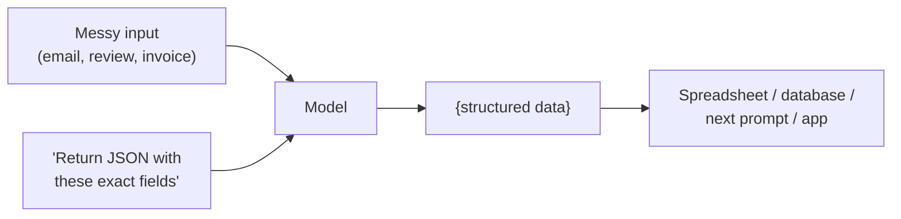

# Lesson 06 — Structured Output

**Goal:** get the model to return answers in a fixed shape — JSON, a table, a
form — that a machine, a spreadsheet, or the next prompt in a pipeline can
consume without a human in the loop.

## What you will learn

- Why structure matters the moment something *other than a human* reads the output
- Asking for JSON, tables, and fixed fields
- Making the structure reliable (the failure modes and their fixes)
- Where this connects to pipelines and automation

---

## Free text is for humans; structure is for machines

When a person reads the answer, prose is fine. But the moment the output feeds a
spreadsheet, a database, a webhook, or another prompt, prose is a liability —
something has to *parse* it, and prose parses unreliably.

So: if a machine reads it next, ask for a machine shape. The most common are
**JSON** (for code), **tables/CSV** (for spreadsheets), and **fixed fields** (for
forms and records).



This one capability — messy text in, clean structured data out — is the engine
behind a huge share of real prompt-engineering products: invoices → line items,
reviews → ratings + themes, CVs → fields, support tickets → category + priority.

---

## Ask for the exact shape

Don't say "return structured data." Give the schema — the exact keys and their
types — and one example:

```text
Extract the order details from the message. Return ONLY valid JSON, no prose,
in exactly this shape:

{
  "customer_name": string,
  "items": [{ "name": string, "qty": number }],
  "delivery": boolean,
  "notes": string or null
}

Message: "Hi, it's Mona — 2 cappuccinos and a cheesecake, deliver to the office
please. Make one cappuccino decaf."
```

Expected:

```json
{
  "customer_name": "Mona",
  "items": [
    { "name": "cappuccino", "qty": 2 },
    { "name": "cheesecake", "qty": 1 }
  ],
  "delivery": true,
  "notes": "one cappuccino decaf"
}
```

The keys to reliability: **"return ONLY JSON, no prose,"** an **explicit schema**,
and a rule for **missing values** (`null`, not invented).

---

## The failure modes (and fixes)

| Failure | Fix |
|---|---|
| Wraps JSON in chatter ("Here's your JSON: …") | "Return only the JSON. No explanation, no markdown fences." |
| Invents a value for a missing field | "If a field isn't in the input, use null. Never guess." |
| Keys drift between calls | Give the exact schema every time; use the same field names |
| Breaks on a weird input | Add an example of the weird input → correct output (Lesson 03) |
| Occasionally still malformed | Validate in code and retry; many APIs offer a strict "JSON mode" or schema enforcement — use it |

> **On a small model**, strict JSON is harder — it slips more often. Keep the
> schema small, give an example, and validate. On larger models with a JSON/schema
> mode, near-perfect structure is routine.

---

## Weak vs Good

> **Weak:** "Read this review and tell me the rating and what they liked and
> disliked."
> → A paragraph. You still have to read it and type the data somewhere.
>
> **Good:** "Return JSON: `{ "stars": 1-5, "liked": [string], "disliked":
> [string] }`. Review: `"""Great coffee but the wifi was down and the music was
> too loud."""`"
> → `{ "stars": 3, "liked": ["coffee"], "disliked": ["wifi down", "music too
> loud"] }` — ready to drop straight into a dashboard.

---

## Why this unlocks automation

Structured output is the join between "AI writes something" and "software does
something." Once the model reliably emits `{ "priority": "high" }`, real code can
route the ticket, send the alert, update the sheet — no human reading prose in
the middle. That is the leap from *chatbot* to *system*, and it's exactly what
Lesson 08 (pipelines) and Lesson 10 (agents) build on.

---

## Exercise

Pick a messy text you handle repeatedly (receipts, enquiries, applications).
Define the JSON fields you'd want in a spreadsheet. Write a prompt that returns
only that JSON, with `null` for anything missing. Run it on five real, varied
inputs — including one deliberately incomplete — and confirm it never invents a
value.

---

**Next:** [Lesson 07 — Constraints & Guardrails](07-constraints-and-guardrails.md).
