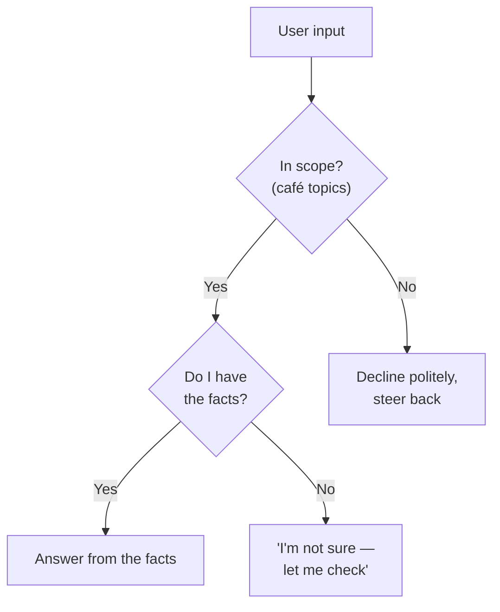

# Lesson 07 — Constraints & Guardrails

**Goal:** control what the model must *not* do, and — most importantly — define
what it should do when it's unsure or the input is bad. This is what separates a
demo from something you can put in front of a customer.

## What you will learn

- Positive vs negative instructions, and why negatives need care
- The "if you're unsure" clause that prevents confident nonsense
- Scope limits: keeping the model on-topic
- Guardrails as the difference between a toy and a product

---

## The constraint that matters most

Everything in Lesson 00 leads here: the model produces plausible text, not true
text, and it does not stop when it lacks a fact — it invents one. The single most
valuable guardrail you can write gives it a way out:

> **"If you are not sure, or the information isn't in what I gave you, say 'I
> don't know' or ask a clarifying question. Do not guess."**

Without this, "helpful" means "confidently wrong." With it, the model escalates
instead of inventing. In any business use — support, medical, legal, financial —
this clause is not optional. A bot that admits uncertainty is trustworthy; one
that fabricates a refund policy is a liability.

---

## Positive and negative instructions

- **Positive:** "Reply in Egyptian Arabic." "Keep it under 50 words." "Offer only
  the standard menu items."
- **Negative:** "Don't mention competitors." "Never promise a delivery time."
  "Don't use the word 'exquisite'."

Negatives work, but with a quirk: naming a thing can put it *in mind*. "Don't
mention discounts" sometimes makes discounts more likely to appear. Two fixes:

1. **Prefer a positive framing when you can.** Instead of "don't be formal," say
   "be casual and warm."
2. **When a negative is essential, pair it with what to do instead.** "Don't
   quote a price; say 'a colleague will confirm pricing.'"

---

## Scope limits — staying on the rails

A support bot for a coffee shop should not write your homework, debate politics,
or roleplay. Bound its scope explicitly:

> "You only answer questions about this café — menu, hours, location, orders. For
> anything else, politely say that's outside what you can help with and steer back
> to the café."

This is both a quality control (it stays useful) and a security control (it
resists being hijacked into doing something off-mission — Lesson 12).

That diagram *is* the guardrail. Every robust assistant has some version of it.

---

## Weak vs Good

> **Weak:** "You're a support bot for our shop. Answer customer questions."
> → Answers café questions. Also cheerfully invents a loyalty program you don't
> have, tells someone you're open on a holiday, and writes a poem when asked.
>
> **Good:** "You're a support bot for Funzo Coffee. Answer only questions about
> our menu, hours, location, and orders, using the info below. If a question
> isn't covered by that info, say 'Let me check and get back to you.' If it's
> off-topic, politely decline. Never invent prices, hours, or promotions.
> `<info>…</info>`"
> → Useful when it can be, honest when it can't, on-topic always.

---

## Guardrails checklist for anything customer-facing

- [ ] An "if unsure / not in the facts, don't guess" clause
- [ ] A scope limit (what topics it will and won't handle)
- [ ] A rule for the most dangerous invention in *your* domain (prices? medical
      advice? legal claims? availability?)
- [ ] A fallback action (escalate to a human, ask a question, say "I'll check")
- [ ] Grounding: "answer only from the provided information" (Lesson 02)

If a workflow is going in front of real users, this checklist is the minimum. It
is also, not coincidentally, most of what makes a workflow *sellable* — a client
is paying for the guardrails as much as the answers (Lesson 14).

---

## Exercise

Take any assistant prompt you've written. Add all five checklist items. Then try
to break it: ask an off-topic question, ask something the facts don't cover, ask
it to invent a promotion. It should decline, escalate, or admit uncertainty every
time. If it invents anything, tighten the matching constraint.

---

**Next:** [Lesson 08 — Chaining & Pipelines](08-prompt-chaining-pipelines.md):
when one prompt isn't enough.
