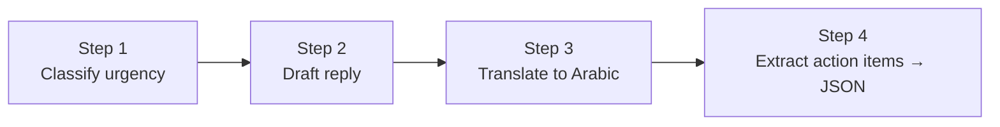
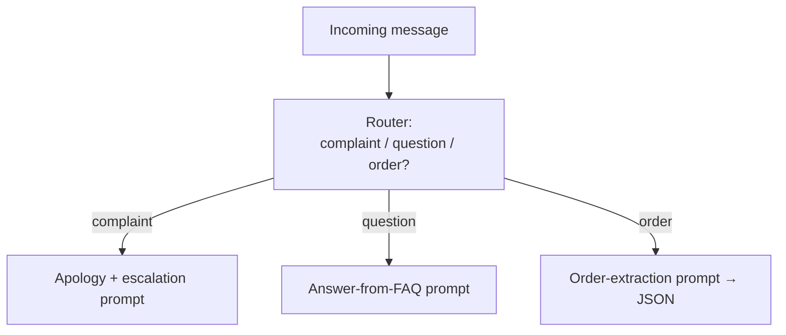

# Lesson 08 — Chaining & Pipelines

**Goal:** stop cramming everything into one giant prompt. Break a hard task into a
sequence of small, reliable prompts whose outputs feed each other — a pipeline you
can test one piece at a time.

## What you will learn

- Why one mega-prompt fails and a chain succeeds
- The common chain patterns (sequential, router, map-reduce)
- Passing structured data between steps
- How to debug a chain (you test each link, not the whole rope)

---

## Why not one big prompt?

Beginners try to do everything in one prompt: "Read this email, decide if it's
urgent, draft a reply, translate it, and log it to a summary." The model does all
five *okay* and none *well*, and when the output is wrong you can't tell which of
the five instructions it botched.

A chain does one thing per step. Each step is simple enough to get right, and
simple enough to test. The output of one becomes the input of the next.



Each box is its own prompt, with its own role, format, and guardrails. This is
the leap from *prompting* to *building systems*, and it's why prompt engineers
who can design chains get paid more than those who only write single prompts.

---

## The three patterns you'll reuse

**1. Sequential** — steps in a line, each refining the last. (The diagram above.)
Good for: process something through stages.

**2. Router** — one prompt classifies the input, then sends it to a specialised
prompt.



Good for: one inbox, many kinds of request. Each branch is simpler and safer than
one prompt trying to handle all cases.

**3. Map-reduce** — run the same prompt over many pieces ("map"), then combine the
results ("reduce"). Summarise each chapter, then summarise the summaries. Good
for: inputs too big for one context window (Lesson 02).

---

## Pass structured data, not prose, between steps

This is where Lesson 06 pays off. If step 1 hands step 2 a paragraph, step 2 has
to re-interpret it and errors compound. If step 1 emits clean JSON, step 2 gets
exact fields. **Structured hand-offs are what make a chain reliable.**

```text
Step 1 output:  { "urgency": "high", "topic": "refund", "customer": "Mona" }
Step 2 input:   uses urgency to pick tone, topic to pick the policy, name to
                personalise — no guessing.
```

A tiny code sketch (optional — the logic is the point, not the language):

```python
classification = call_model(CLASSIFY_PROMPT, message)     # returns JSON
policy         = lookup_policy(classification["topic"])   # plain code
reply          = call_model(REPLY_PROMPT, message, policy, classification)
```

Notice the middle step is ordinary code, not a prompt. **Good pipelines mix
prompts and plain logic** — use the model only where judgement is needed, and
cheap deterministic code everywhere else. It's faster, cheaper, and more reliable.

---

## Weak vs Good

> **Weak:** one prompt: "Read this support email, classify it, draft a reply in
> the customer's language, and give me the action items."
> → Mediocre on all four, and unfixable because you can't isolate the failure.
>
> **Good:** four steps — classify (JSON) → draft (using the class) → translate →
> extract actions (JSON). Each testable alone. When translations go wrong, you fix
> *one* prompt without touching the other three.

---

## Debugging a chain

The whole reason to build chains: **you debug each link, not the rope.**

1. Feed a known input to step 1. Is its output correct and well-formed?
2. Feed step 1's output to step 2. Correct?
3. Continue. The first step that's wrong is your bug — and it's isolated.

Log every step's input and output. When something breaks in production, you'll
see exactly which link failed and on what input. That log is also the start of
your evaluation set (Lesson 11).

---

## Exercise

Take a task you currently do in one overloaded prompt. Draw it as boxes: what are
the distinct steps? Rewrite it as a chain where each step does one job and passes
structured data forward. Test each step alone before connecting them.

---

**Next:** [Lesson 09 — Retrieval (RAG)](09-retrieval-rag.md): feeding the model
your own documents.
