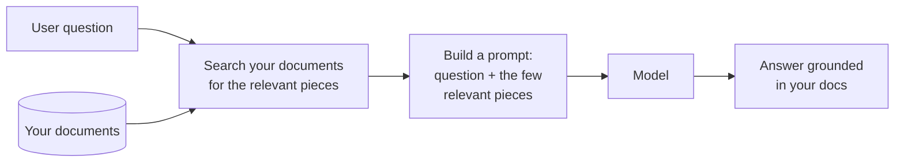
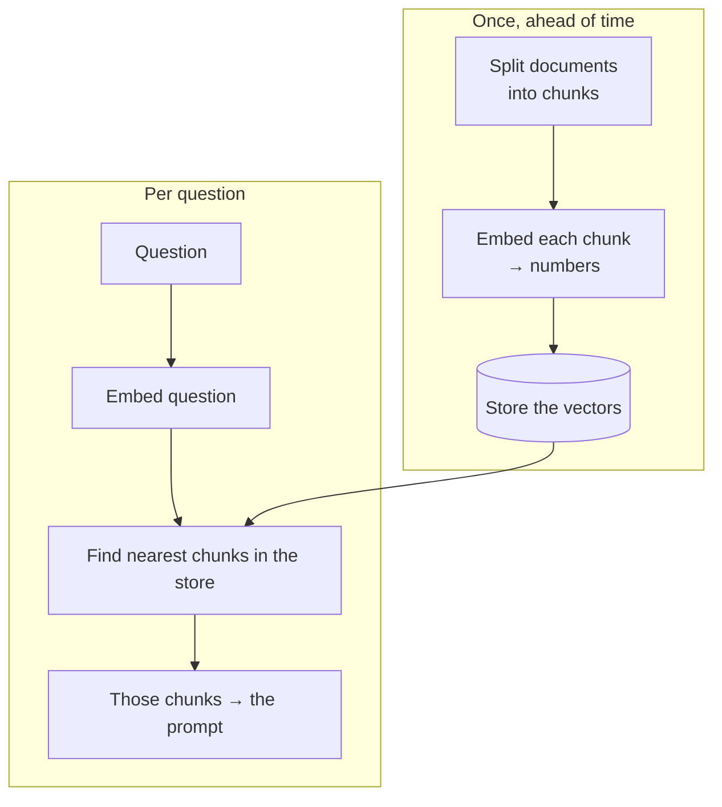

# Lesson 09 — Retrieval (RAG)

**Goal:** understand how to give the model access to your own documents — more
than you could ever paste — so its answers are grounded in your facts, fetched
automatically for each question. This is **retrieval-augmented generation (RAG)**.

## What you will learn

- The problem RAG solves (context window + freshness)
- The mental model: search, then answer
- What "embeddings" are, in plain terms
- The failure modes, and why RAG is mostly a *retrieval* problem

*Concept-first. The optional code is minimal; the ideas matter more.*

---

## The problem

Lesson 02 said: the model only knows what's in the prompt, and you should ground
it in your facts. But you can't paste your entire knowledge base — a 300-page
manual, 10,000 support tickets, a whole product catalogue — into every question.
It won't fit in the context window, it'd be slow and expensive, and the model
attends worse to a huge dump than a focused one.

RAG solves this: for each question, **fetch only the few relevant pieces** and put
*those* in the prompt.

The model doesn't memorise your documents. It reads the relevant slice, fresh,
every time — so when you update a document, the answers update too. No retraining.

---

## Search, then answer

RAG is two jobs bolted together:

1. **Retrieval** — find the pieces of your documents most relevant to the
   question. This is a search problem.
2. **Generation** — hand those pieces to the model with the question and the usual
   grounding instruction ("answer only from these; if they don't cover it, say
   so").

Step 2 is just Lesson 02 done well. **The hard, valuable part is step 1** — good
retrieval. If you fetch the wrong pieces, the best prompt in the world answers the
wrong question confidently.

---

## Embeddings, in plain terms

How does the search find "relevant" pieces when the user's words don't exactly
match the document's words? **Embeddings.**

An embedding turns a piece of text into a list of numbers that captures its
*meaning*. Texts with similar meaning get similar numbers — even if they share no
words. "How do I get my money back?" lands near a document titled "Refund policy,"
because they mean the same thing.

So retrieval works like this: embed every chunk of your documents once and store
the numbers; when a question comes in, embed it too, and grab the chunks whose
numbers are closest. That's a **semantic search** — by meaning, not keywords.

You don't need to build the math. Libraries and hosted "vector databases" do it.
What you must understand is that **your retrieval quality is your product quality.**

---

## Where RAG goes wrong (all in step 1)

| Failure | Cause | Fix |
|---|---|---|
| Answers are off-topic | Retrieval fetched irrelevant chunks | Better chunking; better embeddings; fetch more, then filter |
| Misses info that *is* in the docs | Chunks too big/small; question phrased oddly | Tune chunk size; rephrase query; retrieve more candidates |
| Right chunk retrieved, wrong answer | Weak grounding in the prompt | Strengthen "answer only from these" (Lesson 07) |
| Cites things that aren't there | No grounding, or too many chunks diluting it | Ground hard; fetch fewer, better chunks |

Notice most fixes are in *retrieval*, not the prompt. RAG projects live or die on
getting the right pieces in front of the model.

---

## Weak vs Good

> **Weak (no RAG):** "What's our warranty on the espresso machines?" asked of a
> bare model → a plausible, invented warranty.
>
> **Good (RAG):** the system embeds the question, pulls the warranty section from
> *your* product docs, and prompts: "Answer using only the text below. If it
> doesn't cover the question, say you'll check. `<retrieved: warranty section>`"
> → the real warranty, or an honest "let me check."

---

## When you need RAG vs when you don't

- **Just paste the context** when the facts are small and fit easily (one policy,
  one document). Simpler, cheaper, no infrastructure.
- **Use RAG** when the knowledge is large, changes often, or you don't know in
  advance which slice a question needs (a whole knowledge base, a product
  catalogue, a document archive).

Don't reach for RAG when a paste will do. It's powerful and it's overhead.

---

## Exercise

Take a set of documents you answer questions from (a policy folder, an FAQ, a
manual). Sketch the RAG flow on paper: how would you chunk it, what would a
question retrieve, what would the final prompt look like? You don't have to build
it — designing it correctly is the skill.

---

**Next:** [Lesson 10 — Agents & Tools](10-agents-and-tools.md): letting the model
act, not just answer.
