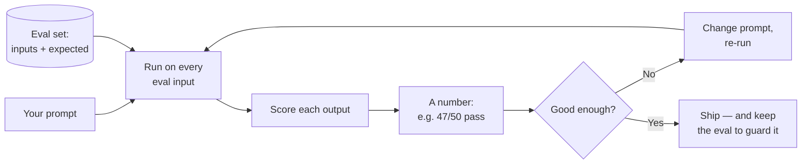

# Lesson 11 — Evaluation

**Goal:** learn to *measure* whether a prompt works, so you can improve it on
purpose instead of by vibes — and so you can prove to a client that it works.
This is the most under-taught and most valuable skill in the course.

## What you will learn

- Why "it looks good" is not evidence
- Building an eval set — the real asset in any prompt business
- Ways to score outputs (exact, rules, model-as-judge, human)
- Catching regressions when you change a prompt or the model changes under you

---

## "It looks good" is how prompts fail in production

You tweak a prompt, try it twice, it looks great, you ship it. Then it fails on
the tenth real customer in a way you never tried. The problem: you tested on
*vibes* and a sample of two. Real evaluation means running the prompt on many
realistic inputs and *scoring* the results.

> The professional mindset shift: a prompt is not "done when it looks good." It's
> done when it **passes your eval set**, and it stays done only as long as it keeps
> passing.

---

## The eval set is the asset

An **eval set** is a collection of realistic inputs paired with what a good output
looks like (or a way to check the output). For a support bot: 50 real questions
and, for each, the correct answer or the rule it must satisfy ("must not invent a
price," "must escalate," "must be in Arabic").

This is why Lesson 00's README claim holds: **prompts are copyable; the eval set
is not.** Your competitor can steal your prompt in a screenshot. They cannot steal
the 200 real, labelled examples that let you know it works and improve it safely.
The eval set is the moat (Lesson 14).

**Build it from real data.** Every logged input from your pipeline (Lesson 08) is
a candidate. The failures are the most valuable — each one you add stops that
class of failure from returning.

---

## How to score an output

Different tasks need different scoring. Use the cheapest one that fits:

| Method | Use when | Cost |
|---|---|---|
| **Exact / rule match** | Output is structured or has a right answer (JSON fields, a label, a number) | Free, instant |
| **Checks / assertions** | You can express "good" as rules ("contains no price", "is valid JSON", "under 50 words", "in Arabic") | Cheap, in code |
| **Model-as-judge** | Quality is subjective (tone, helpfulness) — a second model scores the output against a rubric | Moderate (an extra call) |
| **Human review** | High stakes, or to calibrate the automated scores | Slow, expensive, gold standard |

Most real eval harnesses combine them: rules catch the objective failures for
free, model-as-judge grades the subjective ones, and humans spot-check to make
sure the judge is trustworthy.

A **model-as-judge** prompt is just prompt engineering pointed at grading:
> "Here is a customer question, the ideal answer, and the bot's answer. Score the
> bot 1–5 for accuracy and 1–5 for tone. Penalise any invented fact heavily.
> Return JSON: `{ "accuracy": n, "tone": n, "reason": string }`."

---

## Regressions: the silent killer

Two things change under you:

1. **You edit the prompt** to fix one case — and quietly break three others.
2. **The model updates** (the provider ships a new version) and behaviour shifts.

Without an eval set, you find out from an angry customer. With one, you re-run the
suite after every change and see the score move *before* you ship. This is the
same reason software has automated tests. A prompt system without an eval set is
untested software in front of customers.

---

## Weak vs Good

> **Weak:** "I improved the prompt — look, this example is better now." (n=1, no
> record of what it does to everything else.)
>
> **Good:** "The new prompt scores 48/50 vs the old 44/50 on our eval set;
> the two it now fails are edge cases X and Y, which I've added to the set to fix
> next." That sentence is what a client pays a professional for.

---

## Exercise

For a prompt you rely on, collect 10–20 real, varied inputs. For each, write down
what a correct output must satisfy (a rule or an example). Run your current prompt
on all of them and score it honestly. You now have a number — and the failures are
your to-do list. Grow the set as you find new failure types.

---

**Next:** [Lesson 12 — Prompt Security](12-prompt-security.md): keeping your
system safe and your prompt private.
