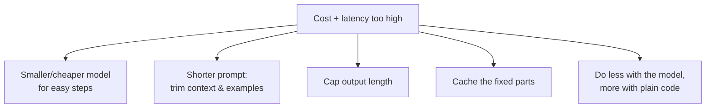

# Lesson 13 — Cost, Tokens & Latency

**Goal:** understand that every word in a prompt is money and milliseconds, and
learn the levers that cut both without hurting quality. This is what turns a
workflow that *works* into one you can *afford to run at scale*.

## What you will learn

- How you're actually billed (tokens in + tokens out)
- Why Arabic costs more, and what to do about it
- The levers: model choice, prompt length, caching, output limits
- The quality/cost/speed trade-off you're always making

---

## You pay per token, both directions

From Lesson 00, models read and write in **tokens** (word-ish chunks). Providers
bill for **input tokens** (your whole prompt — system prompt + context + examples
+ user message) *and* **output tokens** (what the model generates), usually with
output priced higher.

Two consequences:

- A long system prompt and big pasted context are paid **on every single call**.
  A 2,000-token system prompt used a million times is a real bill.
- Asking for a long answer costs more than asking for a short one — and is slower.

**Latency** tracks tokens too: more input to read and more output to generate both
mean the user waits longer. Cost and speed usually move together.

---

## Arabic costs more

The same meaning is typically **2–3× more tokens in Arabic than in English**,
because models were trained on far more English text and tokenise it more
efficiently. For a business serving Arabic customers this is a real line item.

Practical responses (not "switch to English" — serve your users):
- Keep system prompts tight; don't pad.
- Don't send more context than the question needs.
- Cache the fixed parts (below).
- Price the workflow knowing Arabic throughput costs more — and factor it in when
  you quote a client (Lesson 14).

---

## The levers

**1. Right-size the model.** Don't use the biggest, most expensive model for a
simple classification. In a pipeline (Lesson 08), use a cheap fast model for the
easy steps (routing, extraction) and a strong model only where judgement is
needed. This one habit often cuts cost by most of it.

**2. Trim the prompt.** Every example and every paragraph of context is paid every
call. Use the *fewest* examples that pass your eval set (Lesson 11), and retrieve
only the relevant context (Lesson 09) instead of dumping everything.

**3. Cap the output.** Ask for "3 bullet points" or "under 50 words" or strict
JSON — you pay for what it writes, and shorter is faster too.

**4. Cache the fixed parts.** If your system prompt and instructions are identical
every call, many providers offer **prompt caching** so you're not billed full
price to re-read the unchanging prefix each time. Big savings for high-volume
workflows with a large stable system prompt.

**5. Let plain code do the deterministic work.** Don't ask the model to do
arithmetic, sort a list, or look up a fixed value — that's a tool or a line of
code (Lessons 08, 10). The model is for judgement, not for things a calculator
does cheaper and correctly.

---

## The trade-off you're always making

Quality, cost, and speed pull against each other. A bigger model and more
reasoning (Lesson 04) raise quality but cost more and run slower. The
professional move is to **decide per step what the task actually needs** and spend
only there:

| Step | Needs | Choose |
|---|---|---|
| Route a message to a category | Speed, low cost | Small model, tiny prompt, capped output |
| Draft a delicate customer reply | Quality | Strong model, a few examples, guardrails |
| Extract fields to JSON | Reliability, low cost | Small model + strict schema + validation |
| Final legal/medical-adjacent check | Quality, safety | Strong model + human review |

There's no universal answer — there's the right answer *for this step*, found by
measuring (Lesson 11).

---

## Weak vs Good

> **Weak:** one giant strong-model call with a 3,000-token system prompt and "give
> me a thorough detailed answer" — run on every message. Slow, and a bill that
> scales badly.
>
> **Good:** cheap model routes and extracts; strong model only drafts the reply;
> system prompt trimmed and cached; outputs capped. Same quality where it counts,
> a fraction of the cost and latency — which is the difference between a workflow
> a client can afford and one they can't.

---

## Exercise

Take a prompt you run often. Estimate roughly: how long is the input (system +
context + message), and how long is the output? Now find one word of each lever:
Could a smaller model do it? Can you cut the context? Cap the output? Cache the
fixed part? Move any step to plain code? Apply the cheapest win and check the eval
score didn't drop.

---

**Next:** [Lesson 14 — Prompt Engineering as a Business](14-prompt-engineering-as-a-business.md):
turning all of this into income.
