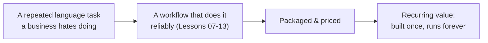
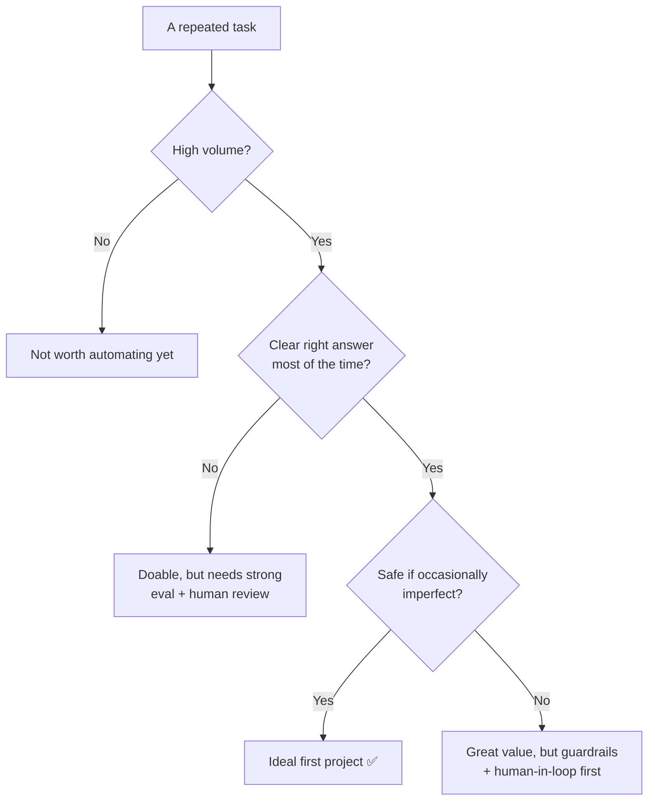
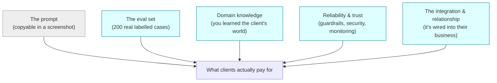

# Lesson 14 — Prompt Engineering as a Business

**Goal:** turn the skill into income. This lesson shows the shapes a prompt-
engineering business takes, how to price it, where the defensible value is, and a
concrete 30-day plan from zero to a first paying workflow. No code — this is the
lesson for everyone.

## What you will learn

- The five business shapes, from freelance to SaaS
- How to *find* a workflow worth money
- Pricing: why you sell outcomes, not prompts
- The moat: why your work survives even though prompts are copyable
- A 30-day plan to a first paid workflow

---

## Why this is a business at all

Every organisation runs on **repeated language tasks**: answering the same
questions, writing the same kinds of copy, reading the same kinds of documents,
sorting the same requests. Each one costs someone hours, every week, forever. A
prompt engineer turns one of those tasks into a reliable AI workflow — and
"reliable" is the word that gets paid for. Anyone can get a flashy demo; a
professional delivers something that works on the hundredth real case, safely,
and keeps working. That gap is the whole business.

---

## The five shapes

| Shape | You sell | Good first move because… | Example |
|---|---|---|---|
| **Freelance / done-for-you** | One reliable workflow built for one client | Fast to start, real money, teaches you the domain | A clinic's WhatsApp bot that books appointments and never invents a schedule |
| **Productised service** | The *same* workflow sold to many clients in one niche | You build once, sell many; sane scope | "Menu → QR website" for cafés; "contract → plain-English summary" for small law firms |
| **Micro-SaaS** | A hosted tool wrapping your prompt system, monthly fee | Recurring revenue, scales beyond your hours | Turns support tickets into drafted replies for e-commerce teams |
| **Internal role** | Prompt engineering *inside* a company (salary) | Stable, deep, you see real scale and data | Halving a support team's handle time |
| **Teaching / content** | The skill itself | Builds reputation, leads to the others | This course; workshops; a paid newsletter |

Most people start **freelance or productised**, because you can begin this week
with no funding, and the first client teaches you the niche you'll productise.

---

## Finding a workflow worth money

The task is worth money when it is **repeated, painful, and language-shaped**. Ask
a business owner three questions:

1. *"What do you or your team type the same kind of thing over and over?"*
   (replies, descriptions, summaries, quotes)
2. *"What documents or messages do you read and sort by hand every day?"*
   (invoices, CVs, tickets, enquiries, contracts)
3. *"What question do customers ask you fifty times a week?"*

Any strong answer is a candidate. Pick the one that is **high-volume, low-
ambiguity, and low-stakes-if-slightly-wrong first** — that's where AI shines and
where you'll succeed early. Save the high-stakes work (medical, legal, financial)
for when your evaluation and guardrails are strong.

---

## Pricing: sell the outcome, not the prompt

The beginner mistake is charging for "a prompt" — a thing worth almost nothing,
because it's copyable. Charge for the **outcome and the reliability**:

- **Value, not effort.** "This saves your two support staff 15 hours a week" is
  the pitch. Price against the hours or the salary saved, not against the
  afternoon it took you.
- **Common structures:** a **setup fee** to build and tune the workflow, plus a
  **monthly retainer** to run it, monitor it, keep the eval set growing, and
  adapt when the model changes. Recurring beats one-off.
- **Productised:** a flat package price per client in your niche, because the
  scope is fixed and you've done it before.
- **SaaS:** monthly subscription tiers by volume.

Never compete on being the cheapest prompt. Compete on *"mine is the one that
actually works, and I can prove it"* (Lesson 11).

---

## The moat: why your business survives copyable prompts

"But anyone can copy my prompt." Yes. And it won't help them, because the prompt
is the smallest part of what you built:

A competitor can copy your wording. They cannot copy the hundreds of real,
labelled examples that prove it works (Lesson 11), the domain knowledge you earned
solving the problem, the security and guardrails that make it safe (Lessons 07,
12), or the trust and integration you built with the client. **That is why this
course spends so long on evaluation, security, and reliability** — they are the
business, not the footnote.

---

## A 30-day plan to a first paid workflow

**Week 1 — Learn the shape.** Do lessons 00–07 here. Pick one niche you already
understand (your job, a family business, a friend's shop).

**Week 2 — Find the task.** Talk to 3–5 people in that niche. Ask the three
questions above. Find one repeated, painful, language-shaped task. Build a rough
prompt for it and a small eval set of 10–20 real examples (Lesson 11).

**Week 3 — Make it reliable.** Add guardrails and grounding (Lessons 02, 07). If
it's more than one step, make it a small pipeline (Lesson 08). Get the eval score
high. Check the obvious injection risks (Lesson 12). Now it's not a demo — it's a
workflow.

**Week 4 — Package and pitch.** Write down the outcome in the client's terms
("saves ~X hours/week, never invents Y"). Price it: setup + monthly. Show the one
person whose problem it solves. Deliver it, keep growing the eval set, and let
that first result become your case study for the next client.

Then repeat in the same niche — the second client is faster, and the third makes
it a **productised service**.

---

## Weak vs Good — the pitch

> **Weak:** "I do prompt engineering / AI. Want a chatbot?"
> → Vague, sounds like everyone, competes on price.
>
> **Good:** "I build support bots for Cairo clinics that book appointments and
> never invent a doctor's availability. My last one cut the front desk's message
> load by 60%, and I can show you exactly how I measure that it stays accurate.
> Setup is X, then Y/month to run and maintain it."
> → Specific niche, specific outcome, proof, clear price. That's a business.

---

## Exercise

Write your one-sentence offer in the "Good pitch" shape above: *for [specific
niche], I build [specific workflow] that [specific outcome], and I prove it works
by [your eval approach], priced at [setup + monthly].* If you can't fill every
blank yet, the blank you can't fill is your next lesson to revisit.

---

**You've finished the course.** Go back to [`README.md`](../README.md) for the map,
raid [`examples/weak-vs-good.md`](../examples/weak-vs-good.md) for reusable moves,
and use [`templates/prompt-template.md`](../templates/prompt-template.md) to start
your next real prompt.
