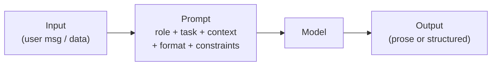
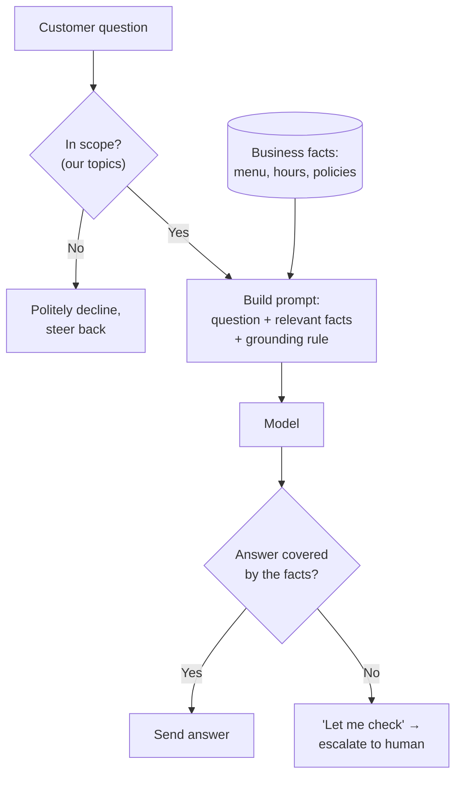
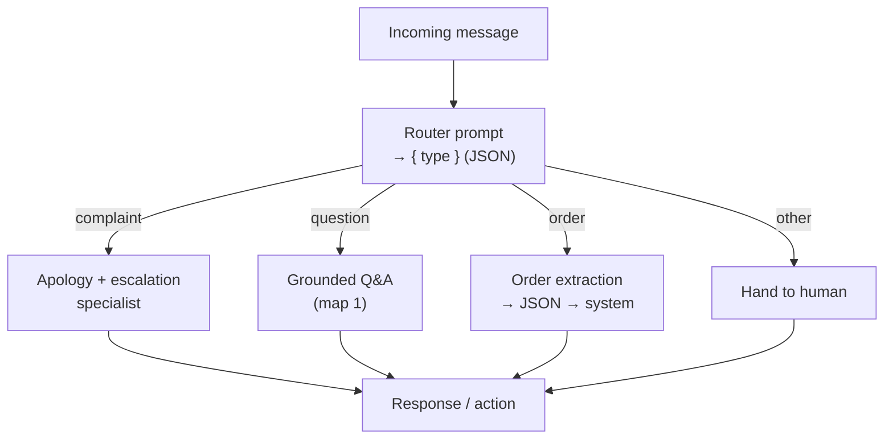
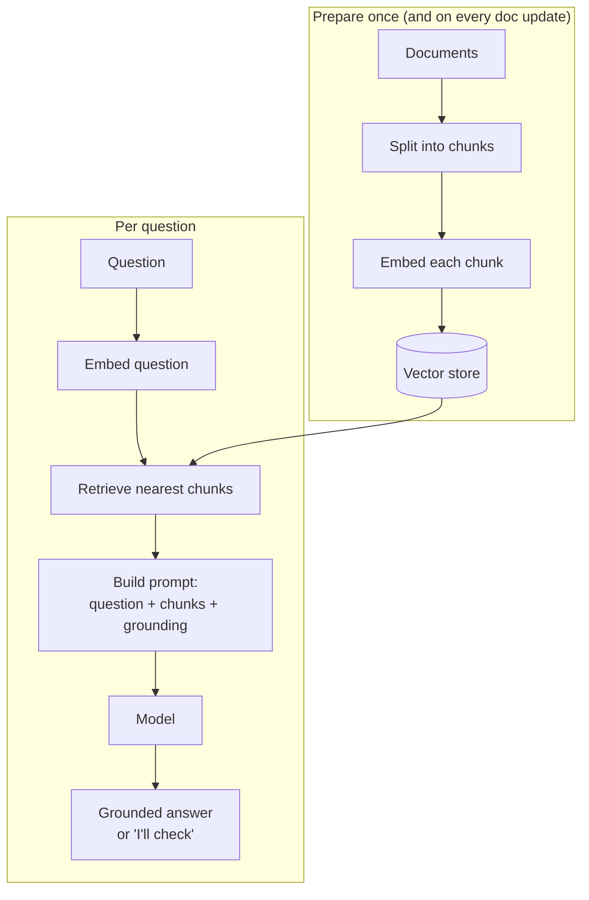
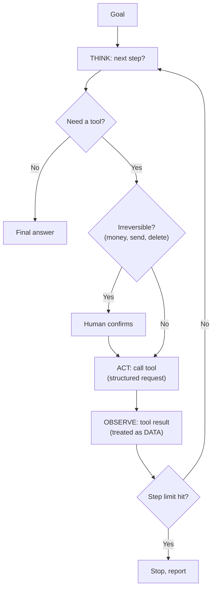
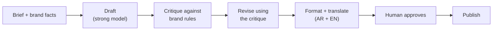
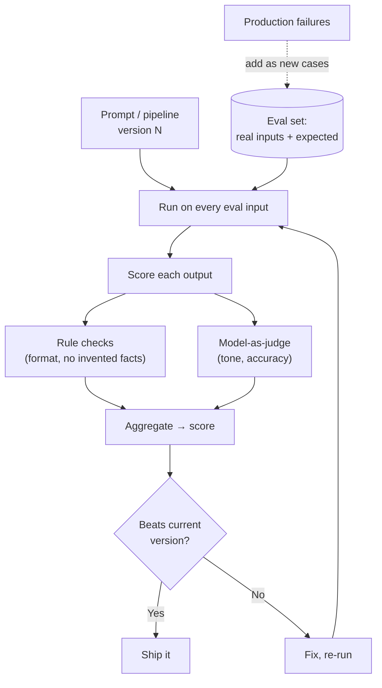
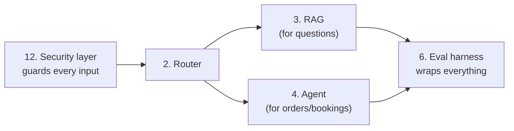

# System Maps & Pipelines

How real prompt systems are actually wired. Each map below is a complete,
buildable design — the kind of thing you'd sketch for a client before writing a
line of anything. They reuse the techniques from the lessons; the lesson number
is noted where a piece comes from.

Read these to see how single prompts combine into systems, and to have a diagram
you can adapt for your own projects.

---

## 0. The atom: one prompt

Before the systems, the unit they're built from. Every box in every diagram below
is one of these.

*Built from Lessons 01–07. Everything else is these, wired together.*

---

## 1. Support bot (grounded Q&A)

The most common first product. Answers customer questions from *your* facts,
escalates when it can't. No memory of the business — the facts are injected.

*Lessons 02 (grounding), 07 (scope + escape hatch). Add RAG (map 3) when the facts
outgrow a single paste.*

---

## 2. Router → specialists (one inbox, many jobs)

When one channel receives many *kinds* of request, classify first, then send each
to a specialised prompt. Each branch is simpler and safer than one prompt trying
to do everything.

*Lessons 06 (JSON routing), 08 (router pattern). The router is a cheap small-model
call (Lesson 13).*

---

## 3. RAG pipeline (answers from a big knowledge base)

When the facts are too large to paste, retrieve only the relevant pieces per
question. Two phases: prepare the documents once, then answer each query.

*Lesson 09. Quality lives in the retrieval half — get the right chunks and the
prompt half is easy.*

---

## 4. Agent loop (the model takes actions)

When the task needs steps and tools, not one answer. The model thinks, calls a
tool, reads the result, and repeats — with hard limits and a human gate on
anything irreversible.

*Lessons 10 (loop, tools), 12 (results are data, not instructions), 13 (step
limit caps cost).*

---

## 5. Content factory (draft → refine → format)

A sequential chain that produces polished, on-brand content at volume. Each stage
does one job; a human approves at the end.

*Lessons 04 (critique = reasoning), 08 (sequential chain), 05 (brand role). The
critique step catches most quality problems before a human sees the draft.*

---

## 6. Evaluation harness (how you know any of it works)

This wraps *any* of the systems above. It's what turns "looks good" into a number,
and what protects you when you change a prompt or the model updates.

*Lesson 11. The dotted line is the flywheel: every real failure becomes a permanent
test, and the growing eval set is your moat (Lesson 14).*

---

## How they compose

Real products stack these. A mature support system is often:

Start with **one** map — usually map 1 — get it reliable with map 6, and add the
others only when a real need appears. Complexity you don't need is cost and risk,
not sophistication.
